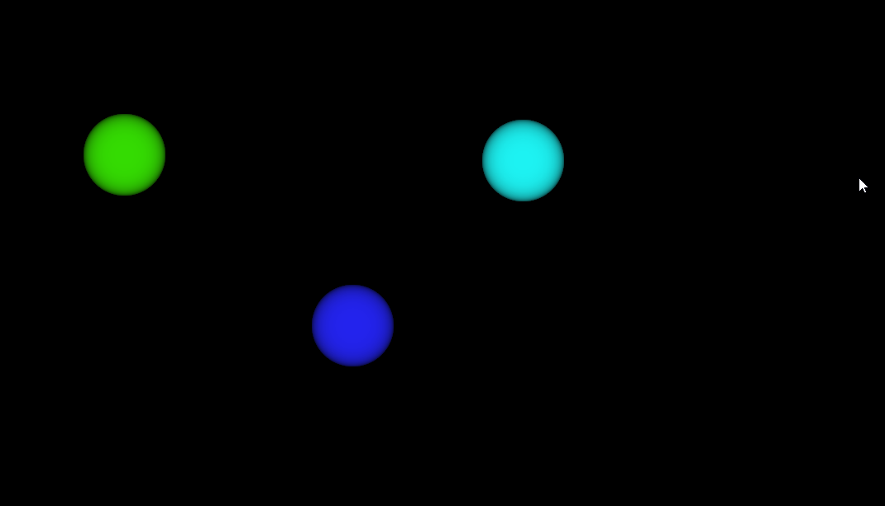
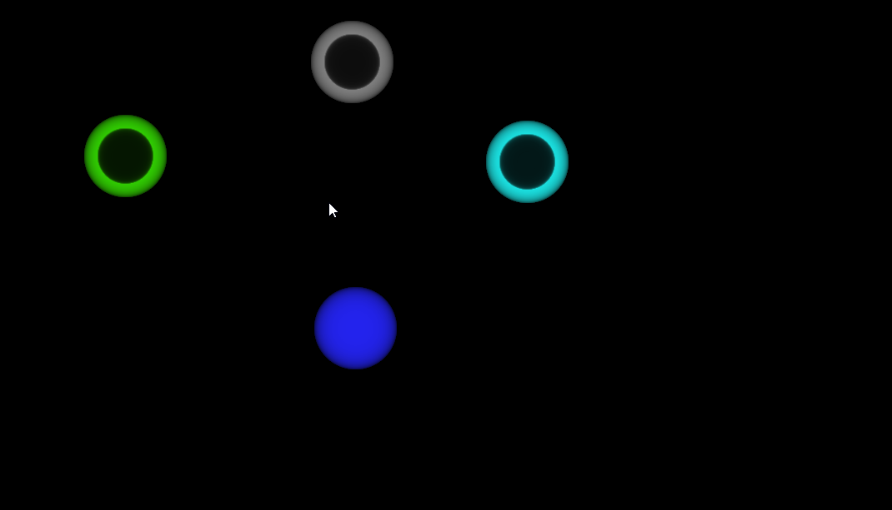

# Chose one

[Go to the application](https://webgiss.github.io/chose-one/) ( [https://webgiss.github.io/chose-one/](https://webgiss.github.io/chose-one/) )

Chose one helps you to make a random choice between a set of things.

Make one click/tap for each choice. Wait for the application to chose one.

# Screenshots

## First choice

## Second choice

## Third choice

## Fourth choice

## Resolution

The application has chosen the second choice

